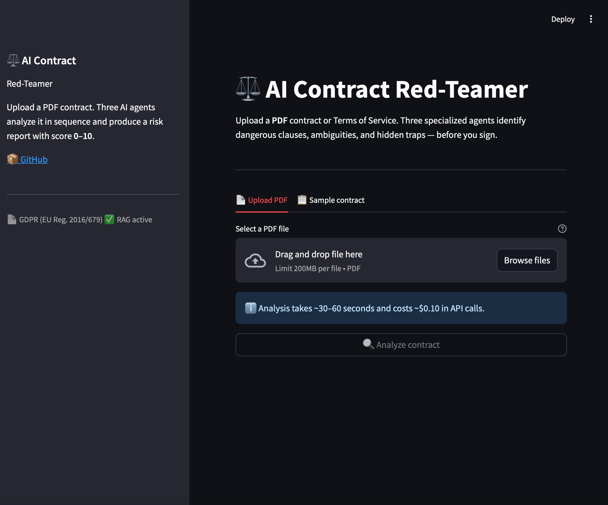
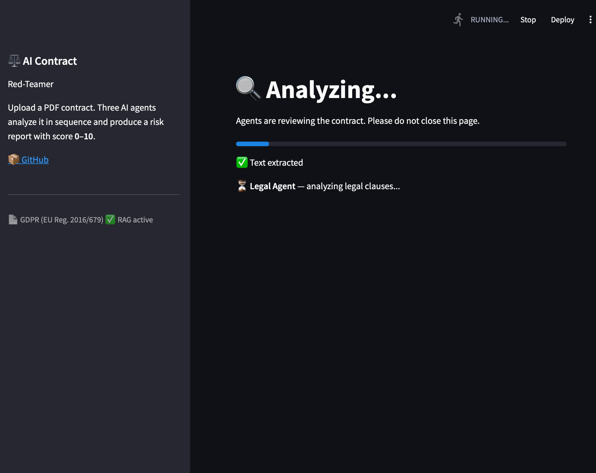
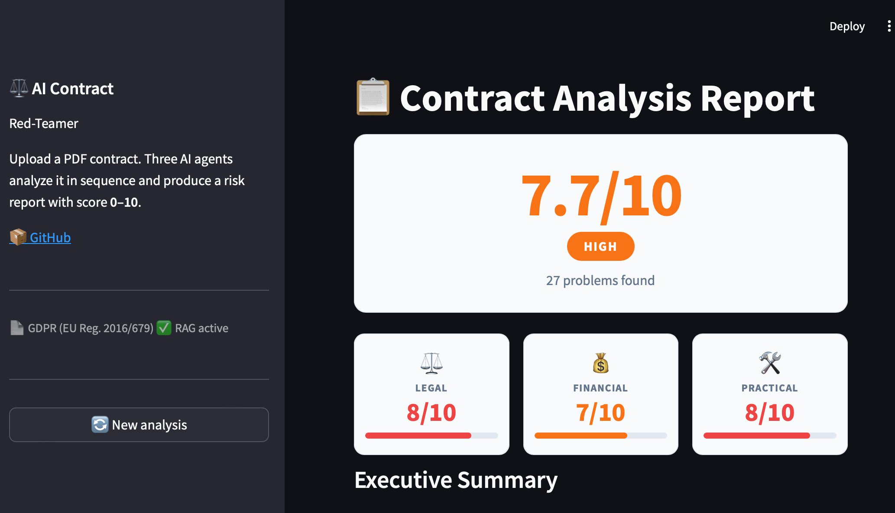
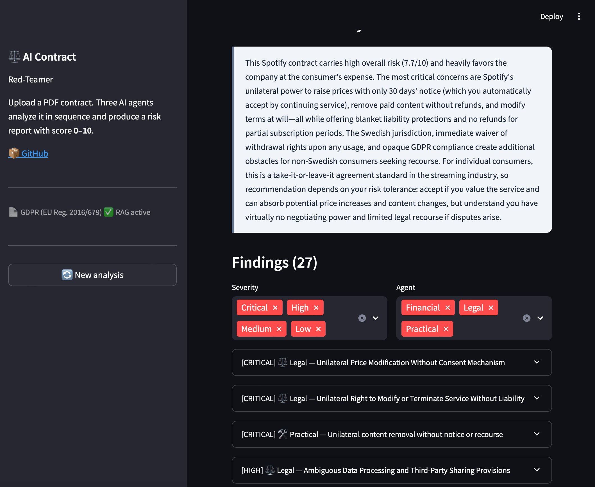
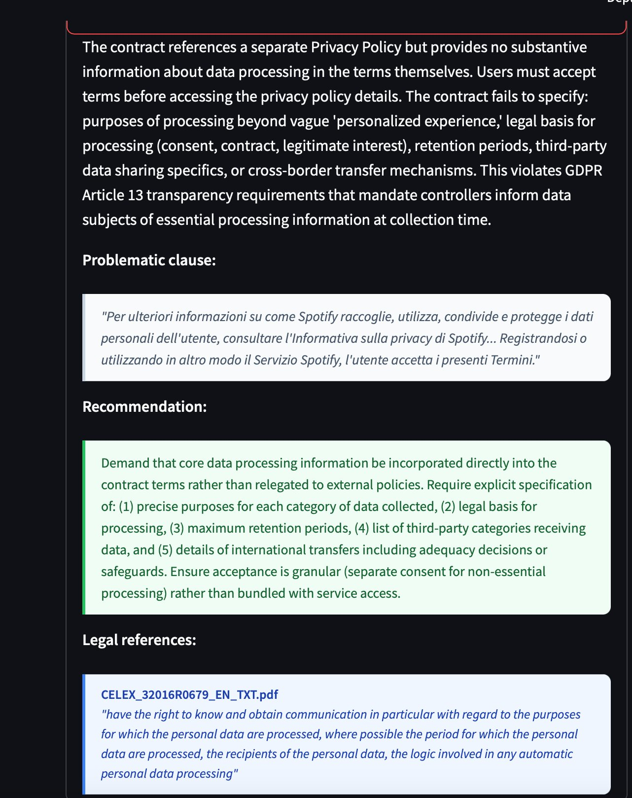

# ⚖️ AI Contract Red-Teamer

> Multi-agent AI system that analyzes PDF contracts for risky clauses, using RAG over GDPR legislation.
> Three specialized agents (Legal, Financial, Practical) identify dangerous clauses, ambiguities,
> and hidden traps — before you sign.

[](tests/)
[](https://python.org)

---

## Demo

> Tested on real Spotify Terms of Service (Italian PDF, 273 KB) — the system produces a **7.7/10 HIGH**
> risk report with 27 findings, citing GDPR Article 13 from indexed legal sources.

### Upload

*Upload a PDF contract or use the included sample.*

### Live analysis

*Three specialized agents analyze the contract sequentially, with live progress updates.*

### Risk report

*Color-coded risk score (0–10) with per-agent breakdown and executive summary.*

### Findings list

*All findings filterable by severity (Critical / High / Medium / Low) and agent type, sorted by severity.*

### Detailed finding with GDPR citations

*Each finding includes the problematic clause (cited verbatim in source language), an actionable
recommendation, and verbatim citations from indexed legal sources via RAG
(here: GDPR Article 13 on transparency requirements).*

---

## Features

- **Multi-agent analysis** — three specialized agents attack the contract from different angles simultaneously
- **RAG-augmented** — cites real GDPR articles from 547 indexed chunks (EU Reg. 2016/679, EN)
- **Multilingual support** — handles contracts in any language; UI and analysis output always in English; original clauses cited verbatim
- **Weighted risk scoring** — Legal 40%, Financial 35%, Practical 25%
- **Filterable findings** — by severity and agent type, ordered by risk
- **Downloadable reports** — Markdown or JSON
- **Production-ready** — Docker support, 54 unit tests, container healthchecks

## Tech Stack

The backend is Python 3.11. LLM reasoning runs on the Anthropic API (`claude-sonnet-4-5`) with direct API
calls — no framework wrapper. Embeddings are generated via Voyage AI (`voyage-3`) and stored in ChromaDB.
The frontend is Streamlit. PDF extraction uses pdfplumber with a configurable character limit to handle
both short contracts and long legal documents. The test suite has 54 tests written with pytest, using
fully mocked Anthropic and Voyage AI clients (zero API cost to run).

## Quick Start

```bash
# 1. Clone and create a virtual environment
git clone https://github.com/eddyAi-0/ai-contract-red-teamer.git
cd ai-contract-red-teamer
python -m venv venv
source venv/bin/activate       # Windows: venv\Scripts\activate

# 2. Install dependencies
pip install -r requirements.txt

# 3. Configure API keys
cp .env.example .env
# Edit .env — add ANTHROPIC_API_KEY (required) and VOYAGE_API_KEY (for RAG)

# 4. Index the GDPR reference document (one-time, ~2 minutes)
python -m rag.indexer

# 5. Run
streamlit run app.py
```

Open [http://localhost:8501](http://localhost:8501) in your browser.

## 🐳 Docker

Run the entire stack with a single command:

```bash
cp .env.example .env
# Add ANTHROPIC_API_KEY and VOYAGE_API_KEY to .env

docker-compose up --build
```

Open [http://localhost:8501](http://localhost:8501)

The GDPR vector store is persisted in a named Docker volume — the first run takes ~2 minutes to index;
subsequent runs start instantly.

## Architecture

Three specialized agents attack the same contract from different angles, then an Orchestrator
synthesizes their findings into a final risk report.

```
PDF / Text Input
      │
      ▼
┌─────────────────────────────────────────┐
│              Orchestrator               │
│  coordinates agents, computes risk score│
└────────┬──────────┬──────────┬──────────┘
         │          │          │
    ┌────▼───┐ ┌────▼───┐ ┌───▼────┐
    │ Legal  │ │Finance │ │Practic.│
    │ Agent  │ │ Agent  │ │ Agent  │
    └────────┘ └────────┘ └────────┘
         │          │          │
         └──────────┴──────────┘
                    │
              Final Report
           (risk score 0–10)
```

| Agent | Focus areas |
|---|---|
| **Legal** | Ambiguous clauses, GDPR violations, unilateral modification rights, jurisdiction traps, disproportionate liability caps |
| **Financial** | Hidden costs, disproportionate penalties, auto-renewals, unfavorable payment conditions |
| **Practical** | Unrealistic obligations, impossible deadlines, missing exit clauses, vague compliance requirements |

| Agent | Score weight |
|---|---|
| Legal | 40% |
| Financial | 35% |
| Practical | 25% |

## Notable engineering decisions

**RAG indexing vs. contract truncation.** `extract_text_from_pdf` accepts an optional `max_chars`
parameter (default: 25 000) to protect the LLM context window when analyzing user-uploaded contracts.
The indexer calls the same function with `max_chars=None` to load the full 88-page GDPR document.
Without this distinction, the English GDPR PDF was silently truncated to ~7 pages, yielding 38 chunks
instead of 547 — a 14× reduction in RAG coverage discovered only by comparing chunk counts.

**Sequential agents, not parallel.** The three agents run one after the other rather than concurrently.
This keeps the live progress UI clear (each step completes before the next starts) and avoids saturating
the Anthropic API with simultaneous requests on a single key.

**Stale cache recovery.** Streamlit's `@st.cache_resource` keeps the VectorStore object alive across
page reloads. If `rag/chroma_db/` is deleted and rebuilt while the server is running, the cached object
holds a reference to a now-deleted ChromaDB collection UUID. A `_safe_vectorstore()` wrapper probes the
collection on every call; on failure it clears the Streamlit cache and re-initializes transparently,
preventing the "Collection does not exist" crash without requiring a server restart.

**JSON parsing hardening.** The Anthropic API occasionally returns control characters (U+0000–U+001F,
excluding `\n`, `\t`, `\r`) inside JSON strings extracted from contract text. These silently break
`json.loads`. A `re.sub` pass runs before every parse attempt. `max_tokens` is raised to 8 192 only
for the structured-output methods, leaving the free-text `analyze()` path unchanged.

## Multilingual handling

The system is designed to handle contracts in any language. Agent system prompts explicitly instruct
the model to quote contract clauses verbatim (preserving the original language) while writing titles,
descriptions, recommendations, and summaries in English. This makes the output consistent regardless
of whether the input is Italian, German, French, or English.

## Testing

```bash
python -m pytest tests/ -v
```

54 tests cover the agent layer, the Orchestrator, the RAG pipeline, and the vector store — all with
mocked Anthropic and Voyage AI clients. No API calls, no cost.

## Project structure

```
ai-contract-red-teamer/
├── agents/
│   ├── base_agent.py          # Anthropic API call, JSON retry, control-char cleanup
│   ├── legal_agent.py
│   ├── financial_agent.py
│   └── practical_agent.py
├── orchestrator/
│   └── orchestrator.py        # Weighted scoring, finding merge, executive summary
├── rag/
│   ├── vectorstore.py         # ChromaDB + Voyage AI, stale-cache recovery
│   ├── indexer.py             # Indexes PDFs from rag/documents/ with no char limit
│   └── documents/             # GDPR EN (EU Reg. 2016/679) — 547 chunks
├── ui/
│   ├── styles.py              # CSS injection and color helpers
│   └── report_renderer.py     # Streamlit report rendering and Markdown export
├── utils/
│   └── pdf_parser.py          # PDF extraction, configurable max_chars, truncation marker
├── tests/                     # 54 unit tests
├── screenshots/
├── app.py                     # Streamlit entry point and state machine
├── Dockerfile
├── docker-compose.yml
└── .env.example
```

## Roadmap

- [x] Step 1 — Project setup, BaseAgent, PDF parser
- [x] Step 2 — Legal, Financial, Practical agents + Orchestrator + RAG
- [x] Step 3 — Streamlit frontend with live progress and filterable report
- [x] Step 4 — Docker support for one-command deployment
- [ ] Step 5 — Deploy on Streamlit Cloud
- [ ] Step 6 — Additional legal sources (German BGB, US consumer law)
- [ ] Step 7 — Multi-document comparison

## License

MIT
